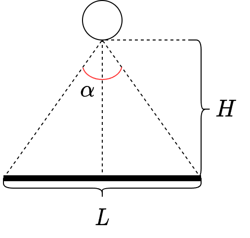

# ML System Design Doc - [RU]
## Дизайн ML системы - Диагностика попадания постороннего предмета в газовоздушный тракт двигателя

*Шаблон ML System Design Doc от телеграм-канала [Reliable ML](https://t.me/reliable_ml)*   

- Рекомендации по процессу заполнения документа (workflow) - [здесь](https://github.com/IrinaGoloshchapova/ml_system_design_doc_ru/blob/main/ML_System_Design_Doc_Workflow.md).  
- Детальный доклад о том, что такое ML System Design Doc и о том, как, когда и зачем его составлять - [тут](https://www.youtube.com/watch?v=PW9TGNr1Vqk).

> ## Термины и пояснения
> - ПП - посторонний предмет
> - ППП - попадание постороннего предмета
> - ГВТ - газовоздушный тракт
> - АД - авиационный двигатель
> - ПОД - подсистема оптической диагностики
> - ПД-35 - Перспективный Двигатель тягой 35 тонн

### 1. Цели и предпосылки 
#### 1.1. Зачем идем в разработку продукта?  

**Бизнес-цель:** выход на рынок с двухконтурным турбовентиляторным двигателем сверхбольшой тяги
для установки на широкофюзеляжные самолёты.

**Почему станет лучше, чем сейчас, от использования ML:**
- Повышение конкурентоспособности;
- Уменьшение затрат при проведении профилактического обслуживания (отслеживание накопительного эффекта от ППП);
- Предотвращение возможных последствий ППП в ГВТ АД на систему аэропорта, а также воздушное судно во время взлета, полета и посадки.

**Что будем считать успехом итерации с точки зрения бизнеса:** интеграция ПОД в систему диагностики самолета
( раз мы не подписыемся под это, значит нужно более приземленно описать успех ЭТОЙ итерации, например, учитывая критерии успеха ).

#### 1.2. Бизнес-требования и ограничения  

- Датчик ПОД размещается внутри мотогандолы в районе воздухозаборника и состоит из: цифровой камеры,
системы освещения области наблюдения, технологическое окно в воздухозаборнике мотогандолы
вместе с защитным вибростойским стеклом, корпус с системой крепления.
  - В темное время суток, в зависимости от угла рассеивания света, чем ближе ППП к датчику ПОД, тем меньший участок
  будет освещен, следовательно, сложнее отследить ПП.
  - Технологическое окно может запотевать, обледенеть или быть загрязненным. Это усложняет отслеживание ППП.
  - Имеется ограничение на угол обзора и поворота камеры.
- Датчик должен содержать программный комплекс диагностики ППП, который должен обнаружить и предоставить информацию о ПП.
  - Ограничиваемся задачами обнаруженя, классификации, локализации (один объект), детектирования (несколько объектов), сегментации.
  -  И что? Кому он должен предоставить информацию? Как быстро? Что должно произойти после получения информации? В реально времени или пакетном режиме? Если пакетный режим, то с какой частотой/задержкой/пропускной способностью?
  -  Что нужно сохранять в инференсе (например, для дообучения)? Каким образом происходит логирование? Возможно, этот вопрос стоит опустить в пункт с предпосылкой решения.

- Угол обзора камеры и частота кадров должна обеспечить минимум 1-2 снимка предмета, влетающего в воздухозаборник
на скорости до 300 км/час. 
  - Учитывая формулу (1), для получения одного снимка около основания мотогондолы, требуется камера с 60 FPS, а для для двух с 120 FPS.
  - Варьируя R формуле (2), для совершения одного снимка на расстоянии 50см от камеры, требуется 332 FPS, а для совершения
  снимка на расстоянии 3м от камеры, требуется 55 FPS.
  - Учитывая формулу (3), требуется угол обзора в 30 градусов для охвата области от мотогондолы до вентилятора.
  -  Учитывая воздушный поток, интересно построить модель, которая может показать распределение ППП
    в область двигателя в зависимости от размера и массы ПП. Это поможет окончательно определиться с необходимым FPS камеры

- Диагностика ППП должна быть развернута в системе самолета СОИ-ППП-ПД-35 и связан по шине стандарта передачи данных ARINC-429
с датчиком ПОД.
  -  И что? Какие ограничения накладывает и на что? (ограничения на ресурсы, пропускуную способность и т.д.) 
  
$$FPS=\frac{N*V}{L-(L-2l)}$$, (1)

$FPS$ - количества кадров в секунду;

$N$ - требуемое количество совершенных снимков ППП;

$V$ - скорость ППП

$L$ - расстояние от края мотогондолы до вентилятора (или максимальный охват камеры);

$$l=R*\frac{L/2}{H}, (2)

$R$ - расстояние до ППП по перпендикуляру;

$$\tg \alpha =\frac{2H}{L/2}$$, (3)

$\alpha $ - угол обзора камеры;

$H$ - расстояние от камеры до основания мотогондолы (или диаметр мотогондолы). 

**Критерии успеха:**
- Количество совершенных снимков ППП (от 1 до 2);
- Скорость или задержка диагностирования ПП  (определить уровень) ;
- Высокая точность обнаружения ППП  (определить HLP) ;
- Высокая точность классификации/локализации/детектирования/сегментации ПП  (определить HLP) .

**Возможные пути развития проекта:**
- Расширение набора данных;
- Конструирование датчика ПОД (эскизный проект, разработка КД, закупака комплектующих и материалов, прототипирование
и изготовление образцов корпуса и крепежа, испытания образцов на вибростенде и в других услвиях);
- Испытания пайплайна на эквивалентном бортовом оборудовании;
- Разработка алгоритма самотестирования (выявление загрязнений и отсутствия освещения на снимках камеры);
- Интеграция ПОД с СОИ-ППП-ПД-35 (передача/чтение данных через ARINC-429, запуск в среде СОИ-ППП-ПД-35, реализация управляющей программы).

#### 1.3. Что входит в скоуп проекта/итерации, что не входит   

**На закрытие каких БТ подписываемся в данной итерации:** подготовка тестового стенда и набора данных с учетом
заданных требований и ограничений, обучение алгоритма обнаружения ППП, демонстрация работы в реальном времени.

**Что не будет закрыто:** конструирование датчика под АД, внедрение ПОД в систему самолета, строгое выполнение ограничений по скорости
и задержке диагностирования ПП ( пока неизвестно, как система будет себя вести в режиме реального времени ).

**Описание результата с точки зрения качества кода и воспроизводимости решения:** используется модульный подход, где каждый
модуль отвечает за свою часть - данные (определение, предобработка и разметка данных), моделирование (выбор и обучение модели,
проведение анализа ошибок), развертывание (на локальной машине). Стилизация и форматирование кода согласно PEP 8, комментарии к функциям и классам,
а также отдельным кускам кода, где требуется пояснение, typing, содержательное описание функций и классов (аргументы и возвраты).
Также необходимо подготовить тесты для анализа работы кода и сделать описание набора данных. В заключение - версионирование
отдельных частей пайплайна (для кода Git, данные хранятся в S3 и версионизируются DVC, артефакты моделей Kubeflow + S3) и мониторинг  (для тестирования ML-моделей хотя бы применять Weights & Biases).

**Описание планируемого технического долга (что оставляем для дальнейшей продуктивизации):**
версионирование и развертывание подсистемы в системе самолета. ( необходимо уточнить критерии успеха и некоторые ограничения )

#### 1.4. Предпосылки решения  

-  что мы мониторим (нагрузку, память, метрики какие-то и т.д.)? Что может пойти не так? Определить пороговые значения для метрик
- Описание всех общих предпосылок решения, используемых в системе – с обоснованием от запроса бизнеса: какие блоки данных используем, горизонт прогноза, гранулярность модели, и др. `Data Scientist`  

### 2. Методология `Data Scientist`     

#### 2.1. Постановка задачи  

- Что делаем с технической точки зрения: рекомендательная система, поиск аномалий, прогноз, оптимизация, и др. `Data Scientist`  

#### 2.2. Блок-схема решения  

- Блок-схема для бейзлайна и основного MVP с ключевыми этапами решения задачи: подготовка данных, построение прогнозных моделей, оптимизация, тестирование, закрытие технического долга, подготовка пилота, другое. `Data Scientist`  
- [Пример возможной блок-схемы](https://github.com/IrinaGoloshchapova/ml_system_design_doc_ru/blob/main/product_schema.png?raw=true)
> Схема обязательно включает в себя архитектуру бейзлайна. Если бейзлайн и основной MVP отличаются несущественно, то это может быть одна блок-схема. Если значительно, то рисуем две: отдельно для бейзлайна, отдельно для основного MVP.  
> Если блок-схема **шаблонна** - т.е. её можно скопировать и применить к разным продуктам, то она **некорректна**. Блок-схема должна показывать схему решения для конкретной задачи, поставленной в части 1.    

#### 2.3. Этапы решения задачи `Data Scientist`  

- Для каждого этапа **по результатам EDA** описываем - **отдельно для бейзлайна** и **отдельно для основного MVP** - все про данные и технику решения максимально конкретно. Обозначаем необходимые вводные, технику предполагаемого решения и что ожидаем получить на выходе, чтобы перейти к следующему этапу.  
- Как правило, детальное и структурированное заполнение раздела `2.3` возможно только **по результатам EDA**.  
- Если описание в дизайн доке **шаблонно** - т.е. его можно скопировать и применить к разным продуктам, то оно **некорректно**. Дизайн док должен показывать схему решения для конкретной задачи, поставленной в части 1.  
    
> Примеры этапов:  
> - Этап 2 - Подготовка прогнозных моделей  
> - Этап 3 - Интерпретация моделей (согл. с заказчиком)  
> - Этап 4 - Интеграция бизнес правил для расчета бизнес-метрик качества мрдели  
> - Этап 5 - Подготовка инференса модели по итерациям    
> - Этап 6 - Интеграция бизнес правил  
> - Этап 7 - Разработка оптимизатора (выбор оптимальной итерации)  
> - Этап 8 - Подготовка финального отчета для бизнеса  

*Этап 1 - это обычно, подготовка данных.*  

В этом этапе должно быть следующее:  

- Данные и сущности, на которых будет обучаться ваша модель машинного обучения. Отдельная таблица для целевой переменной (либо целевых переменных разных этапов), отдельная таблица – для признаков.  
  
| Название данных  | Есть ли данные в компании (если да, название источника/витрин) | Требуемый ресурс для получения данных (какие роли нужны) | Проверено ли качество данных (да, нет) |
| ------------- | ------------- | ------------- | ------------- |
| Продажи | DATAMARTS_SALES_PER_DAY  | DE/DS | + |
| ...  | ...  | ... | ... |
 
- Краткое описание результата этапа - что должно быть на выходе: витрины данных, потоки данных, др.  
  
> Чаще всего заполнение раздела невозможно без EDA.

 *Этапы 2 и далее, помимо подготовки данных.*
 
Описание техники **для каждого этапа** должно включать описание **отдельно для MVP** и **отдельно для бейзлайна**:  

- Описание формирования выборки для обучения, тестирования и валидации. Выбор репрезентативных данных для экспериментов, обучения и подготовки пилота (от бизнес-цели и репрезентативности данных с технической точки зрения) `Data Scientist`    
- Горизонт, гранулярность, частоту необходимого пересчета прогнозных моделей `Data Scientist`   
- Определение целевой переменной, согласованное с бизнесом `Data Scientist`   
- Какие метрики качества используем и почему они связаны с бизнес-результатом, обозначенным `Product Owner` в разделах `1` и `3`. Пример - WAPE <= 50% для > 80% категорий, bias ~ 0. Возможна формулировка в терминах относительно бейзлайна, количественно. Для бейзлайна могут быть свои целевые метрики, а может их вообще не быть (если это обосновано) `Data Scientist`   
- Необходимый результат этапа. Например, необходимым результатом может быть не просто достижение каких-либо метрик качества, а включение в модели определенных факторов (флаг промо для прогноза выручки, др.) `Data Scientist`    
- Какие могут быть риски и что планируем с этим делать. Например, необходимый для модели фактор (флаг промо) окажется незначимым для большинства моделей. Или для 50% моделей будет недостаточно данных для оценки `Data Scientist`    
- Верхнеуровневые принципы и обоснования для: feature engineering, подбора алгоритма решения, техники кросс-валидации, интерпретации результата (если применимо).  
- Предусмотрена ли бизнес-проверка результата этапа и как будет проводиться `Data Scientist` & `Product Owner`  
  
### 3. Подготовка пилота  
  
#### 3.1. Способ оценки пилота  
  
- Краткое описание предполагаемого дизайна и способа оценки пилота `Product Owner`, `Data Scientist` with `AB Group` 
  
#### 3.2. Что считаем успешным пилотом  
  
Формализованные в пилоте метрики оценки успешности `Product Owner`   
  
#### 3.3. Подготовка пилота  
  
- Что можем позволить себе, исходя из ожидаемых затрат на вычисления. Если исходно просчитать сложно, то описываем этап расчетов ожидаемой вычислительной сложности на эксперименте с бейзлайном. И предусматриваем уточнение параметров пилота и установку ограничений по вычислительной сложности моделей. `Data Scientist` 

### 4. Внедрение `для production систем, если требуется`    

> Заполнение раздела 4 требуется не для всех дизайн документов. В некоторых случаях результатом итерации может быть расчет каких-то значений, далее используемых в бизнес-процессе для пилота.  
  
#### 4.1. Архитектура решения   
  
- Блок-схема и пояснения: сервисы, назначения, методы API `Data Scientist`  
  
#### 4.2. Описание инфраструктуры и масштабируемости 
  
- Какая инфраструктура выбрана и почему `Data Scientist` 
- Плюсы и минусы выбора `Data Scientist` 
- Почему финальный выбор лучше других альтернатив `Data Scientist` 
  
#### 4.3. Требования к работе системы  
  
- SLA, пропускная способность и задержка `Data Scientist`  
  
#### 4.4. Безопасность системы  
  
- Потенциальная уязвимость системы `Data Scientist`  
  
#### 4.5. Безопасность данных   
  
- Нет ли нарушений GDPR и других законов `Data Scientist`  
  
#### 4.6. Издержки  
  
- Расчетные издержки на работу системы в месяц `Data Scientist`  
  
#### 4.5. Integration points  
  
- Описание взаимодействия между сервисами (методы API и др.) `Data Scientist`  
  
#### 4.6. Риски  
  
- Описание рисков и неопределенностей, которые стоит предусмотреть `Data Scientist`   
  
> ### Материалы для дополнительного погружения в тему  
> - [Шаблон ML System Design Doc [EN] от AWS](https://github.com/eugeneyan/ml-design-docs) и [статья](https://eugeneyan.com/writing/ml-design-docs/) с объяснением каждого раздела  
> - [Верхнеуровневый шаблон ML System Design Doc от Google](https://towardsdatascience.com/the-undeniable-importance-of-design-docs-to-data-scientists-421132561f3c) и [описание общих принципов его заполнения](https://towardsdatascience.com/understanding-design-docs-principles-for-achieving-data-scientists-53e6d5ad6f7e).
> - [ML Design Template](https://www.mle-interviews.com/ml-design-template) от ML Engineering Interviews  
> - Статья [Design Documents for ML Models](https://medium.com/people-ai-engineering/design-documents-for-ml-models-bbcd30402ff7) на Medium. Верхнеуровневые рекомендации по содержанию дизайн-документа и объяснение, зачем он вообще нужен  
> - [Краткий Canvas для ML-проекта от Made with ML](https://madewithml.com/courses/mlops/design/#timeline). Подходит для верхнеуровневого описания идеи, чтобы понять, имеет ли смысл идти дальше.  
